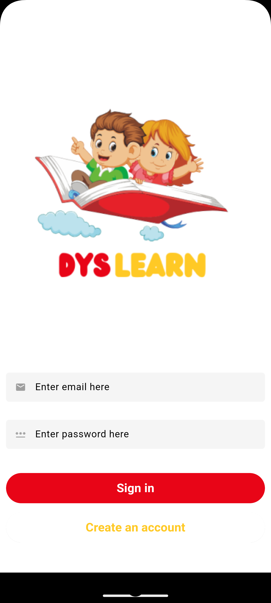
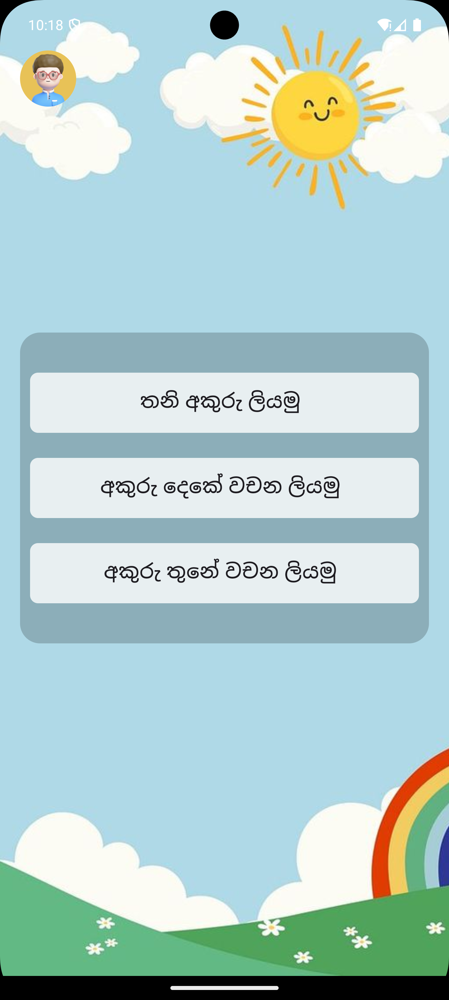
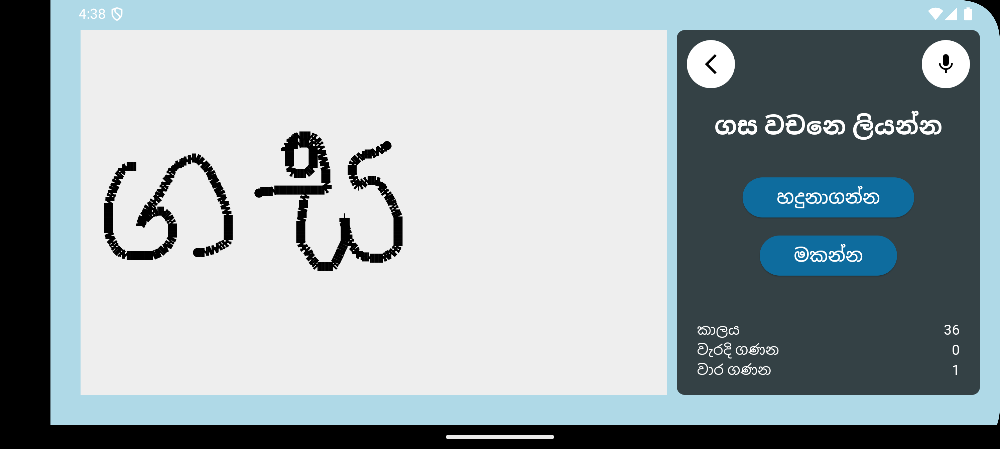
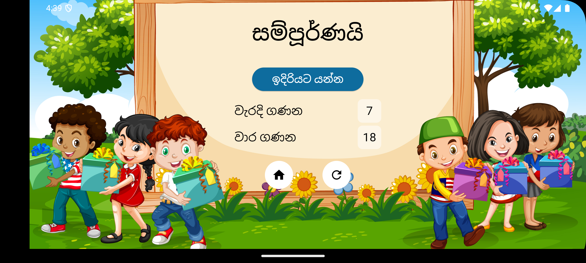
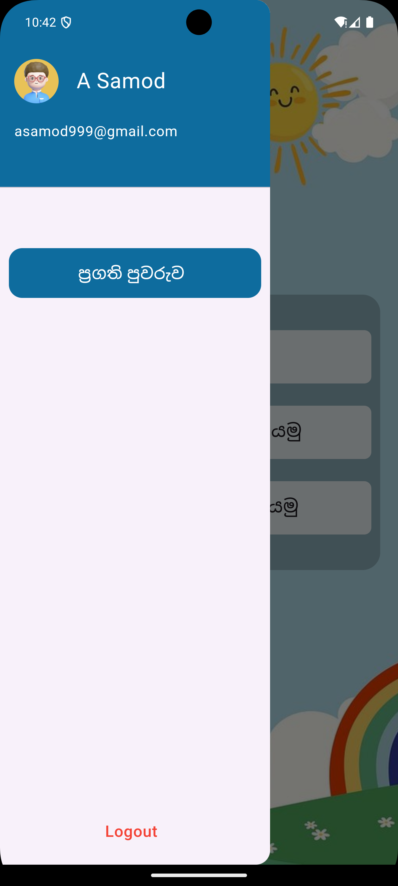
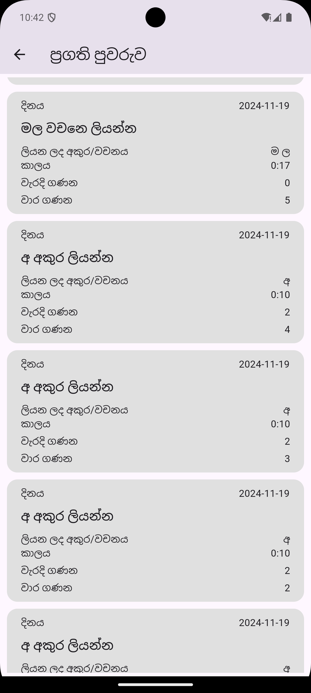

# Dyslexia Learning Assistant for Sinhala Children

This repository hosts the **Dyslexia Learning Assistant for Sinhala Children**, a mobile app designed to help Sinhala-speaking children with dyslexia improve their writing skills. The app addresses the unique challenges of Sinhala’s complex script through innovative tools like Text-to-Speech (TTS) for pronunciation, machine-learning-powered handwriting recognition, and real-time feedback. Tailored exercises, guided by input from teachers, parents, and specialists, provide a personalized learning experience focused on enhancing writing skills.

---

## Features

- **Authentication**: Secure login and registration with Firebase.
- **Interactive Exercises**:
  - Text-to-Speech (TTS) for Sinhala word pronunciation.
  - Handwriting recognition with real-time feedback.
  - Sinhala letter and word practice (single letter, two-letter words, three-letter words).
- **Progress Tracking**: User activity and progress displayed on an interactive dashboard.
- **Personalized Feedback**:
  - Mistake identification and corrections.
  - Suggestions for alternative words.
- **User-Friendly Interface**: Simple navigation tailored for children and parents.

---

## Tech Stack

- **Mobile Framework**: Flutter
- **Backend**: Node.js APIs
- **Database**: MongoDB
- **Authentication**: Firebase
- **Machine Learning**: TensorFlow for Sinhala handwriting recognition

---

## Backend Repository

The mobile app communicates with a dedicated backend server for storing data, processing exercises, and managing user progress.  
Find the backend repository here: [Dyslexia Backend Repository](https://github.com/A-Samod/dyslexia-app-backend-v2)

---

## Installation and Setup
### 1. Clone the repositories:
Clone the **frontend (mobile app)** repository:
```bash
git https://github.com/A-Samod/dyslexia-app-v2.git
```
Clone the backend API repository:
```bash
git https://github.com/A-Samod/dyslexia-app-backend-v2.git
```
Backend Repo
### 2. Set Up the Backend

1. Navigate to the backend directory:
```bash
cd dyslexia-backend
```

2. Install dependencies
```bash
npm install
```
3. Set up environment variables
- Create a .env file in the root directory of the backend project.
- Add necessary configurations: MongoDB connection string and Firebase credentials.

4. Start the backend server:
```bash
npm start
```

The backend should now be running on http://localhost:4000 (or another configured port).

### 3. Set Up the Mobile App (Frontend)
1. Navigate to the mobile app directory:
```bash
cd dyslexia-app-v2
```

2. Install dependencies
```bash
flutter pub get
```

3. Set up Firebase:
- Add your Firebase project configuration to the app (e.g., google-services.json for Android and GoogleService-Info.plist for iOS).

4. Ensure the backend is running.

### 4. Run the App
1. Start the Flutter app:
```bash
flutter run
```
2. Test connectivity:
- The app communicates with the backend via the configured APIs.
- Ensure the backend server and mobile app are running simultaneously for proper functionality.
---
## Screenshots

 1. Login & Register Screen



2. Home Screen



3. Writing Screen



4. Completion Screen



5. Profile Screen



6. Dashboard Screen



---
## How It Works
1. Login or Register: Users (parents or children) can log in or register for an account.
2. Home Screen: Navigate through the app features and start exercises.
3. Writing Exercise: 
    - Listen to a word via TTS. 
    - Write the word directly on the mobile screen.
    - Receive real-time feedback on mistakes.
4. Completion Screen: View success messages and suggestions after completing a session.
5. Dashboard: Track performance, time spent, and progress over time.
